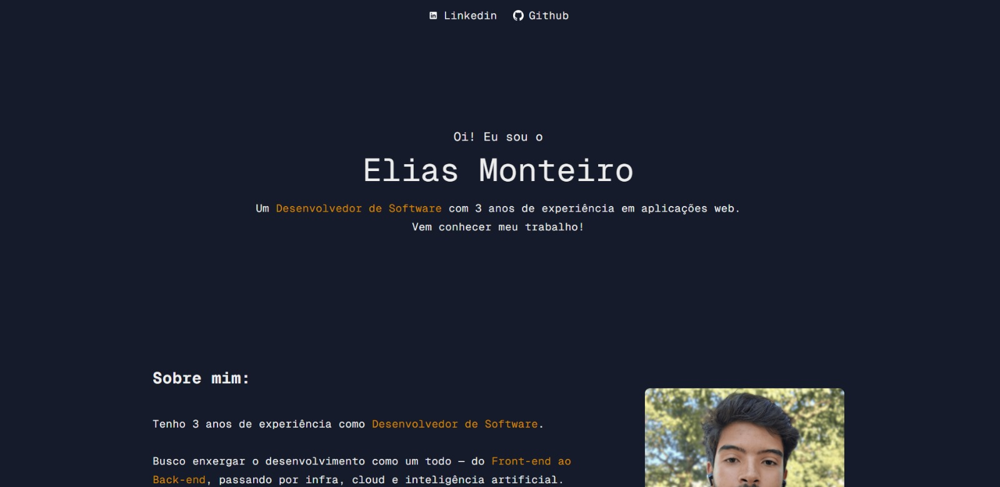
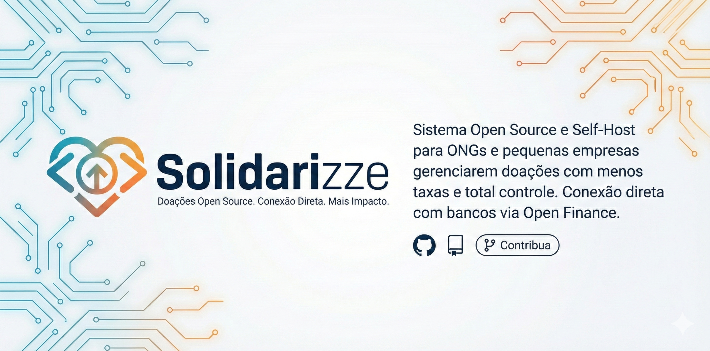

<h2>🖖 Welcome!</h2>

My work focuses on delivering robust, efficient, and scalable solutions for the financial sector. I specialize in backend development, integrating advanced APIs and web services with cloud computing technologies.

<h2>🛠️ Key Skills</h2>
<ul>
  <li>
    <strong>Backend Development:</strong>
    API development using Node.js (Express.js, TypeScript) and Java (Spring Boot), following SOLID principles and applying clean architecture best practices.
  </li>
  <li>
    <strong>Frontend Development:</strong>
    Building user interfaces with Angular and Bootstrap, focusing on best practices and user experience.
  </li>
  <li>
    <strong>Cloud Computing:</strong>
    Leveraging core services from Azure and Google Cloud Platform (GCP) to build robust, scalable, and cost-effective applications.
  </li>
</ul>

---

### 🧰 Languages and Tools

 

#

### 🧑‍💻 My Projects

  <!-- Card 1 -->
  <a href="https://www.portfolioelias.com" style="text-decoration:none; color:inherit;">
    

      
      <h3 align="center" style="margin-top:10px;">
        Portfolio
      </h3>
    

  </a>

  <!-- Card 2 -->
  <a href="https://www.portfolioelias.com" style="text-decoration:none; color:inherit;">
    

      
      <h3 align="center" style="margin-top:10px;">
        Solidarizze
      </h3>
    

  </a>

